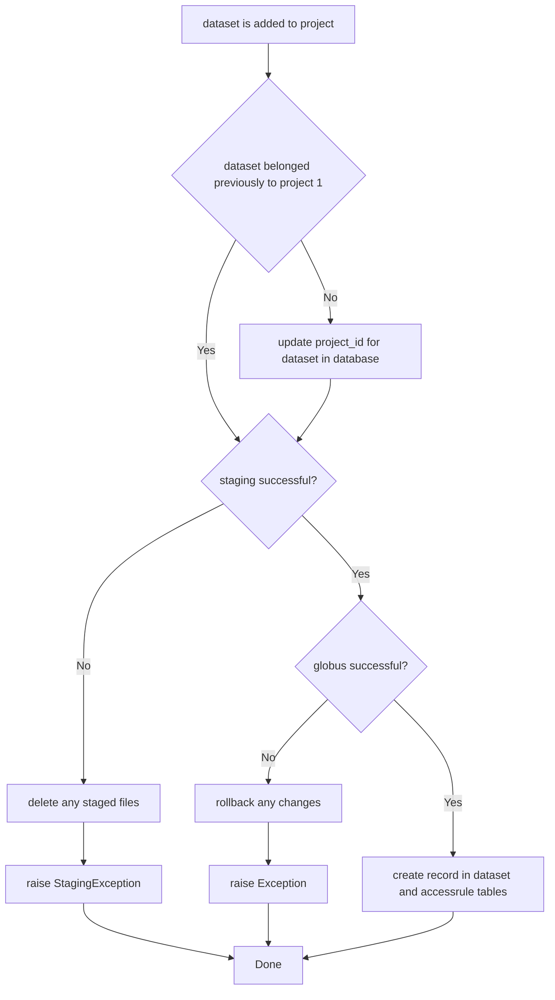
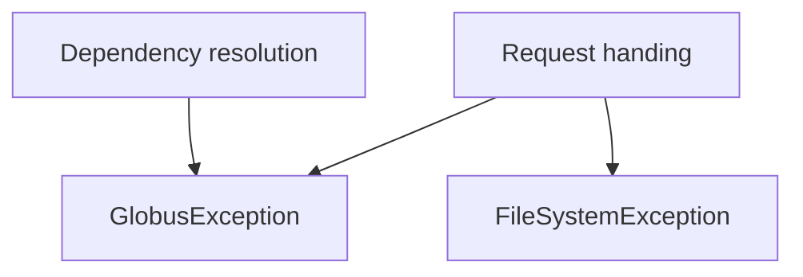

# How the app handles failure

## Contingent vs. non-contingent tasks

If a failure occurs while a request is being fulfilled, subsequent tasks required by that request may be cancelled and tasks completed prior to the failure may need to be reversed, or "rolled back".
Some tasks, however, should be completed regardless of whether other tasks can be completed.
These non-contingent tasks...

Filesystem change: stage dataset, remove dataset
Globus change: add permission, remove permission

Accompanying changes to the filesystem or Globus are changes to the app database, which serve to store a convenient representation of the state of the filesystem and Globus.
Given that this is the purpose of the database, it is clear that updating the database is contingent upon updates to the filesystem and Globus.
However, there is an exception: no matter what, if a dataset changes projects in SMRT Link, then 

> Note: If a dataset belonged to project 1 prior to the request, then it will not be found in the database.

If a dataset is added to a project, but staging or globus tasks fail

If an access rule is created

Most tasks carried out by the app rely on external systems to be successful (e.g. The Globus API must be available to provide a user with access to datasets).
If one of these systems is unavailable or otherwise not operating properly, then 

Exceptions are handled on two main levels: dependency resolution and request processing.

FastAPI attempts to resolve dependencies prior to executing the logic found in the main functions in `endpoints.py`.
Exceptions arising during dependency resolution are caught ???

If no exceptions arise during dependency resolution, then execution proceeds into one of the endpoint functions.
Each request handing procedure is different, however some exceptions are common to all.

### Filesystem

The only entrypoints to the filesystem module are the `stage` and `remove` functions.
Hence, these are the only functions that raise a filesystem exception.

#### Subtypes

**XML exception**

### Globus Exceptions

A Globus exception can arise on either level.
One dependency of every endpoint is a nominal response from Globus.
This ensures that the service is reachable and available.
If Globus is not available, then the request cannot be filled and thus its handing is aborted.

More complex problems can arise during request handling Globus depending on the API operation being used.

### SMRT Link Exceptions

## Heirarchy

Exceptions are handled at the top 

