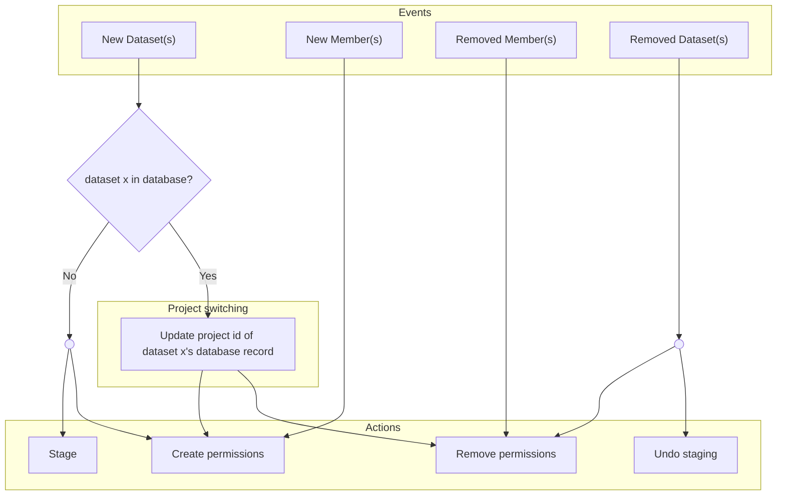

# Keeping the app up-to-date with SMRT Link

SMRT Link determines which users should have access to which datasets. 
When a SMRT Link client modifies this access, these modifications must be indentified so that Globus and the filesystem can be made to reflect them.

## How are access rules represented by SMRT Link?

Unfortunately, SMRT Link does not directly enable user access control on the basis of individual datasets.
Instead, SMRT Link defines users' access to datasets using its "project" feature.
A SMRT Link project is a set of datasets and a set of users dubbed "members".
A user can access a dataset only if that dataset belongs to a project of which the user is a member.

## Representing project data

### SMRT Link representation

Each project is represented by SMRT Link as a set of datasets and a set of project members
(either of these sets may be empty).
The only constraint of this representation is that a dataset can only belong to one project at a time.

### App representation

The app maintains a representation of the state of each project which is updated every time a SMRT Link client places a project-related request.
This representation consists of two database tables, `Dataset` and `AccessRule`.
This representation is a refactoring of project data in terms which align more closely with the purpose of the app.

- The `Dataset` table uses two columns, `dataset_uuid` and `project_id` to represent datasets belonging to projects.

- The `AccessRule` table uses two columns, `project_id` and `user_id` to represent users having membership in projects.

## Translating project state changes to app tasks

There are four steps to determining how to react to a change in the state of a project.

### Step 1: What is the request type?

The first step is to identify the type of the request placed by the SMRT Link client.
There are three project-related requests: `PUT`, `POST` and `DELETE`, whose interpretations are outlined as follows:

- **PUT:** An existing project was updated
- **POST:** A new project was created
- **DELETE:** A project was deleted

### Step 2: Which project does this concern?

The second step is to identify the ID belonging to the project the request concerns. 
This is trivial in the case of HTTP requests using the `PUT` or `DELETE` method. 
These requests contain the ID of the project they concern, found in the requested URI, a.k.a. the "path". 

However, a `POST` request doesn't contain the ID of the project.
Instead, the project in question can be identified by fetching the project with the project ID with the greatest value. 
Project IDs are integers and whenever a new project is created, its ID is assigned as n+1, where n is the highest project ID found immediately before the new project request gets handled.

### Step 3: How did the project state change?

The third step is to compile the set of changes which brings last known project state (recorded in the app database) up-to-date with the current state (fetched from SMRT Link).
These changes are as follows:
- New dataset(s)
- Removed dataset(s)
- New member(s)
- Removed member(s)

The ways to find these changes are outlined below.
The type of request identified in step 1 determines which approach to use.

- **A project was deleted (`DELETE`):**
The most straightforward case, this request resulted in the project being deleted.
A query to the app database infers which datasets belonged to the project prior to the delete and which users had access to those datasets.

- **A new project was created (`POST`):**
Another straightforward case, this request resulted in a new project being created.
The project state fetched from SMRT Link identifies datasets and users which are associated with the new project.

- **An existing project was updated (`PUT`)**
The most complex case, this request may have resulted in a new dataset being added, an existing dataset being removed, a user being granted access to a dataset, a user's access being revoked, or some or all of the above.
To infer these changes, the latest project state (fetched from SMRT Link) is compared with the last known state, and the difference defines the set of changes which would bring the app up-to-date.

### Step 4: Translate the changes in the project state into actions the app should take.

Once the set of changes which brought about the most recent state is identified, the rules diagrammed below can be used to determine which actions the app should take. If there is a new dataset present in the project, then an additional conditional step (project switching) must be performed, as outlined by the diagram.

**Project switching:**
Datasets are only allowed to belong to one project at a time. Therefore, if a dataset belongs to one project and it gets added to another project, then it must be removed from the first project. This task belongs to this stage.

### Algorithms to find transitions

The SMRT Link API provides the state of a given project as a JSON object consisting of an array of project members and an array of datasets.